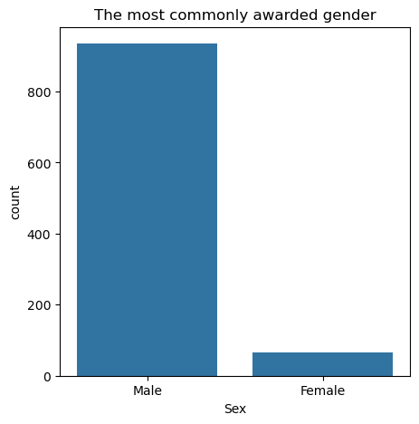
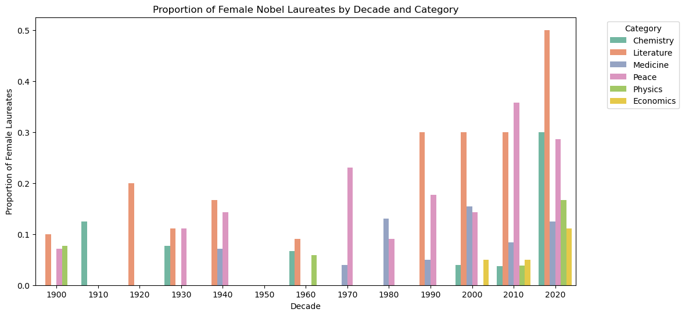
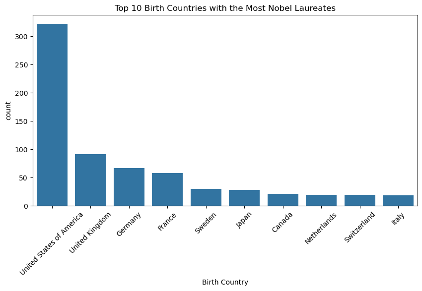

# 🏆 Nobel Prize Analysis (1901–2023)

## 📌 Project Overview
This project analyzes Nobel Prize data from 1901 to 2023, uncovering key trends in gender, nationality, and category distribution.  
All visuals were built in **Jupyter Notebook** using **Matplotlib** and **Seaborn**.

---

## 🎯 Objectives
- Explore demographic and geographic patterns of laureates.  
- Identify long-term shifts in Nobel recognition.  
- Present findings with clear, professional visualizations.  

---

## 📊 Dataset
- **Source:** Nobel Prize dataset (`nobel.csv`).  
- **Features:** Year, Category, Birth Country, Sex, Motivation, etc.  
- **Derived Columns:**  
  - `decade` → Groups laureates by decade  
  - `is_female` → Gender flag  
  - `is_us_born` → US-born flag  

---

## 🔍 Key Insights
- **Gender gap:** Nobel Prizes remain male-dominated, though female representation is slowly improving.  
- **US dominance:** Since the mid-20th century, US-born laureates have consistently led across categories.  
- **Country diversity:** Physics and Chemistry show concentrated awards, while Peace Prizes have the most diverse set of laureates.  

---

## 📸 Visualizations
*(Export your plots as PNGs, save them in an `/images` folder, and replace the links below.)*

- **Gender Distribution**  
  

- **US-born Laureates by Decade**  
  

- **Female Laureates by Category & Decade**  
  

- **Top Birth Countries**  
 

## 📈 Future Work
- Add external datasets (affiliations, socioeconomic factors) for causal analysis.
- Extend dashboard with Nobel laureate search and interactive maps.
- Build predictive models for Nobel Prize trends.
---

## 🖥️ Run Locally
```bash

# Launch Jupyter Notebook
jupyter notebook Nobel_Analysis.ipynb

## 🛠️ Tools & Libraries
- Python (Pandas, Matplotlib, Seaborn)
- Jupyter Notebook
- Git & GitHub

## 👤 Author
**Your Name**  
- [www.linkedin.com/in/joshuaugochukwu](#) | [https://github.com/UCJPENIEL/UCJPENIEL](#)
